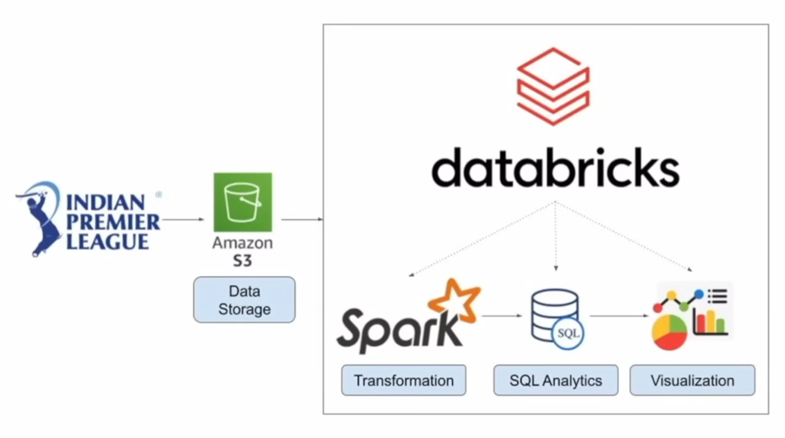
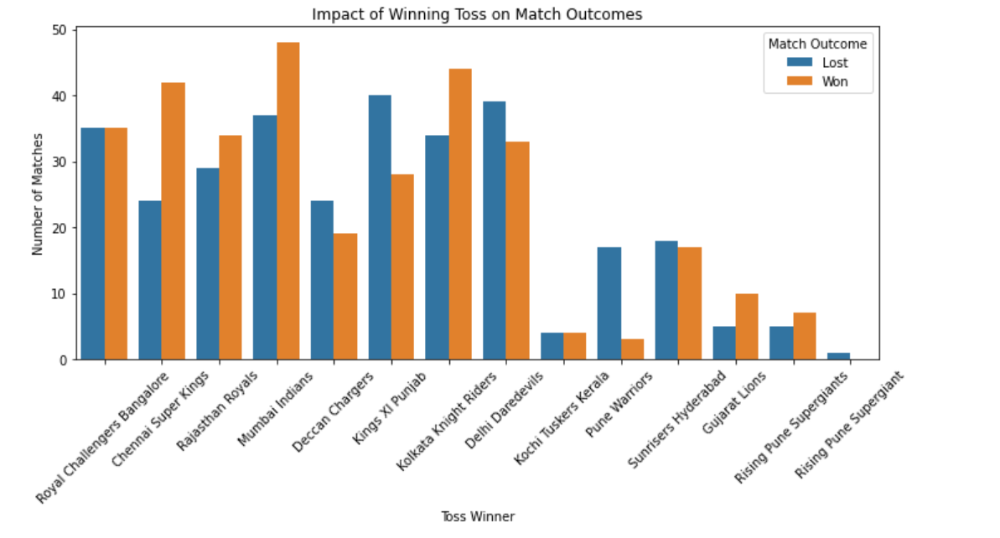
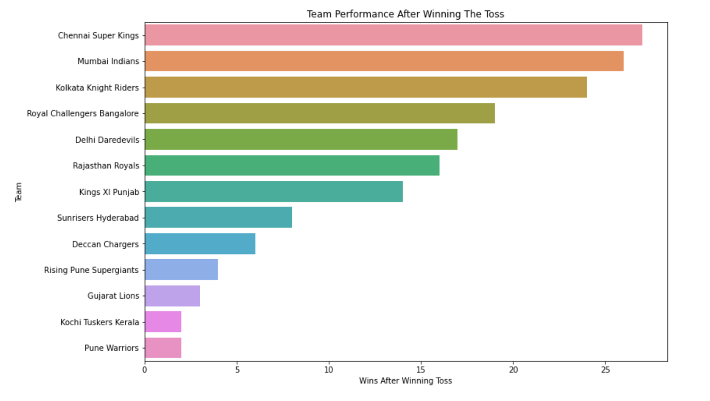

# Ipl-Data-Analysis|AWS Data Engineering Project

## Introduction 
The IPL Data Analysis project leverages Apache Spark and PySpark for large-scale data processing, alongside Databricks for an integrated analytics workspace. AWS S3 is utilized for scalable storage of IPL datasets, while Matplotlib is employed for visualizing insights, making it a comprehensive AWS Data Engineering project.

## Architecture

## Technology Used
1. Programming Language - Python 
2. Spark - SparkSql,Pyspark
3. AWS-S3 Cloud Storage
4. Databricks
5. Matplotlib

## Dataset Used
1. Ball By Ball Data - (https://github.com/Akash-8442/ipl-data-analysis/blob/main/raghu543-ipl-data-till-2017/Ball_By_Ball.csv)
2. Match Data - (https://github.com/Akash-8442/ipl-data-analysis/blob/main/raghu543-ipl-data-till-2017/Match.csv)
3. Player Data - (https://github.com/Akash-8442/ipl-data-analysis/blob/main/raghu543-ipl-data-till-2017/Player.csv)
4. Player_Match Data-(https://github.com/Akash-8442/ipl-data-analysis/blob/main/raghu543-ipl-data-till-2017/Player_match.csv)
5. Team Data - (https://github.com/Akash-8442/ipl-data-analysis/blob/main/raghu543-ipl-data-till-2017/Team.csv)

## Scripts For Project 
[IPL-DATA-ANALYSIS IPYNB FILE](https://github.com/Akash-8442/ipl-data-analysis/blob/main/IPL-DATA-ANALYSIS-PYSPARK%202024-08-22%2023_30_14.ipynb)

## Some Project Outcomes 

